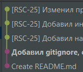

# Renovation Studo

В проекте для кода, написанного на PHP, используется стиль, описанный в [PSR-12](https://www.php-fig.org/psr/psr-12/)

# Правила работы с репозиторием

Основная ветка проект — `main`. В ней хранится весь рабочий и проверенный код.

Прямые коммиты в main запрещены, поэтому вам нужно создать свою собственную ветку, где вы будете работать над своей задачей. 

Под каждый проект есть главная ветка, которая сливается потом в ветку `main`.

### Начало работы ###

Изначально вы находитесь на ветке `main`. 
Из этой ветки вам необходимо переключиться на вашу командную ветку.
Пример:

```
git checkout {ваша командная ветка}
```

После этого вам необходимо создание новой ветку от вашей командой ветки:

```
git checkout -b {Название вашей ветки}
```

Название ветки опредяется из внутренних правил команды.

Когда вы внесете какие-то изменения в код в своей ветке, вам нужно сохранить их с помощью команды `git add`:

```
# По одному:
git add <путь к файлу>

# Или сразу все файлы:
git add . 
```

Эта команда добавляет все измененные файлы в список для сохранения.

Затем нужно сделать коммит:

```
git commit -m "Что было сделано"
```

В кавычках вы должны кратко описать, что вы сделали.

Чтобы отправить изменения в гитхаб, нужно ввести команду:

```
git push
```

Эта команда загружает изменения в гитхаб, где их могут видеть другие разработчики.

Когда работа над своей задачей окончена, вам нужно объединить свою ветку с веткой проекта команды, то есть перенести ваши изменения в основной код проекта.

Пример объединения ветки задачи с веткой `main`:

1. Переключиться на ветку main с помощью команды:

```
git checkout main 
```

2. Обновить ветку main с помощью команды:

```
git pull --ff-only
```

Эта команда загружает последнюю версию кода из `main` на ваш компьютер.

3. Переключиться обратно на свою ветку с помощью команды:

```
git checkout {ваша ветка}
```

4. Синхронизировать свою ветку с `main` с помощью команды:

```
git rebase main
```

Эта команда применяет изменения поверх последних изменений из `main`. Во время выполнения `rebase` могут случиться конфликты. Это нормально. Их необходимо решить.

5. Отправить *свою* ветку на сервер с помощью команды:

```
git push -f
```

Эта команда перезаписывает вашу ветку на сервере согласно вашей локальной версии.

**Проверьте на какой ветке вы находитесь с помощью команды `git branch` ! Ни при каких обстоятельствах не делайте `git push -f` в ветку `main`!**


6. Создать запрос на слияние (Pull Request, PR) в гитхабе — предложение объединить ветку с `main`.

7. Назначить проверяющего вашего PR.

8. Дождаться одобрения вашего запроса на слияние. По необходимости исправить замечания. Проверяющий *не должен* нажимать кнопку `merge`, т.к это создаст мердж-коммит. Мердж коммиты сохраняют все коммиты из обеих веток. Это может привести к дублированию кода, конфликтам слияния и трудностям при отладке.

9. Переключиться на ветку `main` с помощью команды:

```
git checkout main
```

10. Объединить свою ветку с main с помощью команды:

```
git merge {ваша ветка}
```

Эта команда добавляет ваши изменения в основной код проекта.

После этого, ваша ветка должна выглядеть следующим образом:



11. Отправить обновленный `main` на сервер с помощью команды:

```
git push
```

Эта команда загружает новую версию кода из `main` в гитхаб.

### Внимание

После выполнения `rebase`, все ваши коммиты окажутся выше ветки `main`, а также у них поменяются хэши. После этого нельзя будет просто так вытолнуть изменения с вашей ветки в гитхаб, поскольку у коммитов поменялись хэши. Для того, чтобы вытолкнуть изменения необходимо использовать команду `push` с флагом `-f`, чтобы перезаписать всю историю вашей ветки.

```
git push -f
```

### Удаление веток

Когда работа над задачей закончена, то можно удалить вашу ветку в локальном репозитории и на гитхаб.

```
git branch -d {ваша ветка}
git push origin -d {ваша ветка}
```
